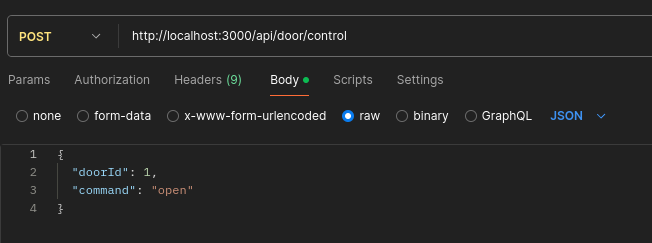

# Sistema de Autenticação Digest em Node.js

## Descrição

Este projeto é um sistema de autenticação que utiliza o Node.js como backend, juntamente com as bibliotecas Zod e Axios para gerenciar a autenticação Digest. O objetivo é fornecer uma maneira segura e eficiente de autenticar usuários em uma aplicação web. Além disso, foi desenvolvido um mini sistema para abrir a porta do administrador, utilizando o dispositivo Hikvision, já testando a autenticação Digest.

## Tecnologias Utilizadas

- **Node.js**: Ambiente de execução JavaScript no servidor.
- **Zod**: Biblioteca para validação de esquemas de dados.
- **Axios**: Cliente HTTP para realizar requisições a APIs.
- **Fastify**: Framework web para Node.js, utilizado para construir APIs de forma rápida e eficiente.
- **dotenv**: Biblioteca para carregar variáveis de ambiente a partir de um arquivo `.env`.

## Funcionalidades

- **Autenticação Digest**: Implementação do protocolo de autenticação Digest para garantir que as credenciais do usuário sejam transmitidas de forma segura. O sistema inclui um mini aplicativo para abrir a porta do administrador, utilizando o dispositivo Hikvision, já testando a autenticação Digest.
- **Validação de Dados**: Utilização do Zod para validar os dados de entrada do usuário, garantindo que as informações estejam corretas antes de serem processadas.
- **Requisições HTTP**: Uso do Axios para realizar requisições a serviços externos, como APIs de autenticação.

## Estrutura do Projeto


## Rota para Abrir a Porta e Testar a Autenticação Digest

**POST**: `http://localhost:3000/api/door/control`

### Body:
```json
{
  "doorId": 1,
  "command": "open"
}

```
